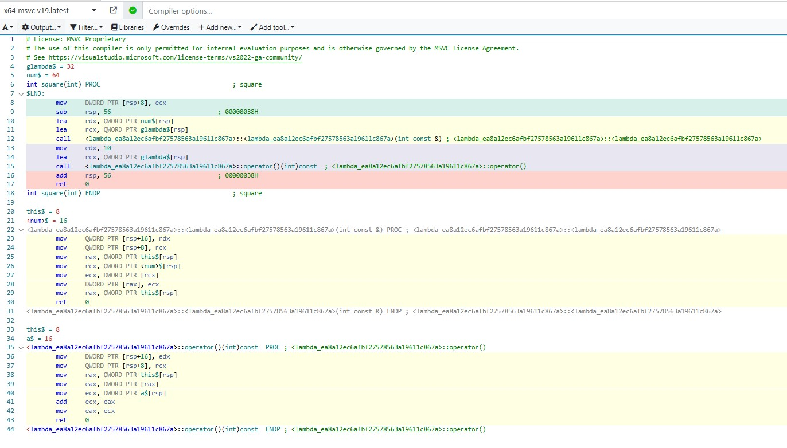
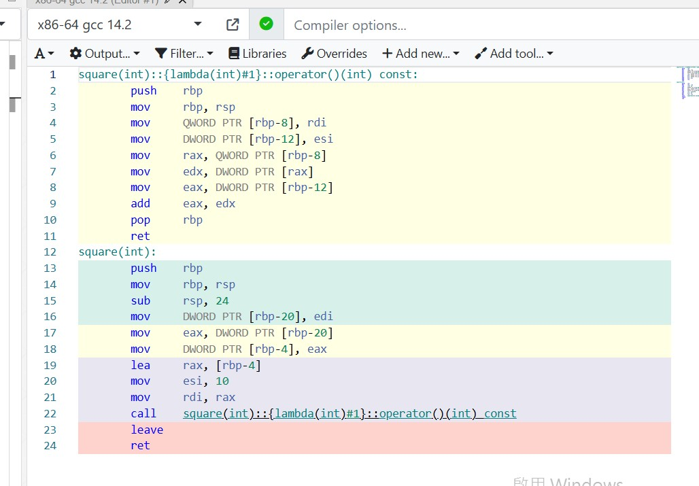

godbolt-cpp-lambda
==================
[Lambda expressions (since C++11) - cppreference.com](https://en.cppreference.com/w/cpp/language/lambda)
```cpp
int square(int num) {
    auto glambda = [num](int a) { return a + num; };
    return glambda(10);
}
```


